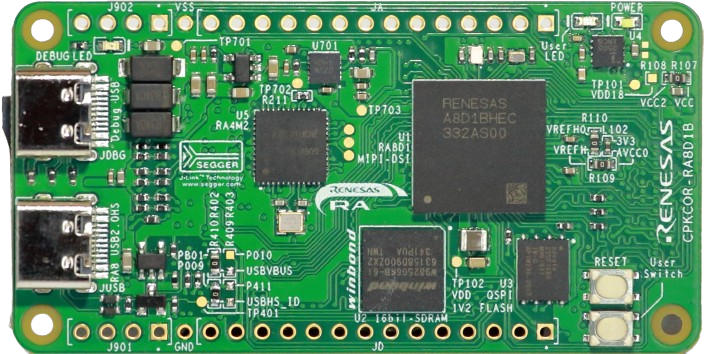
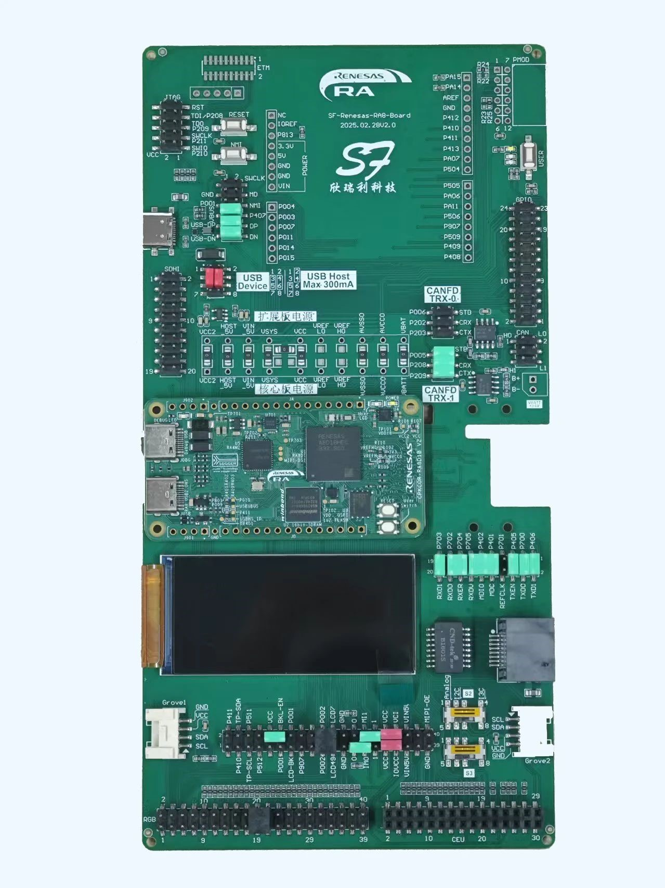
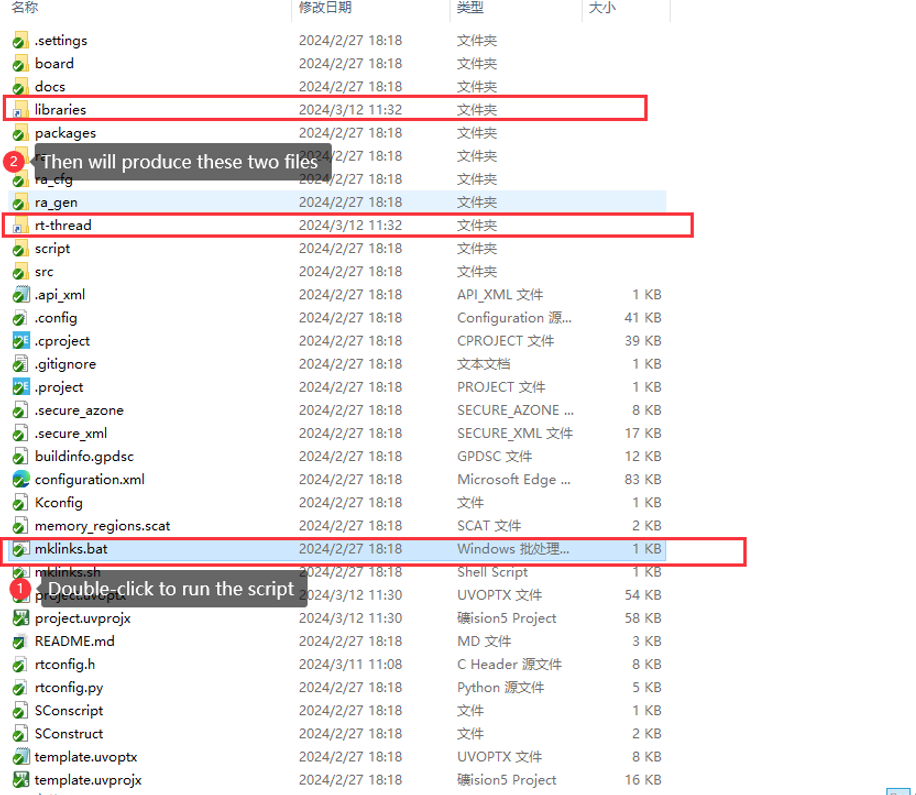
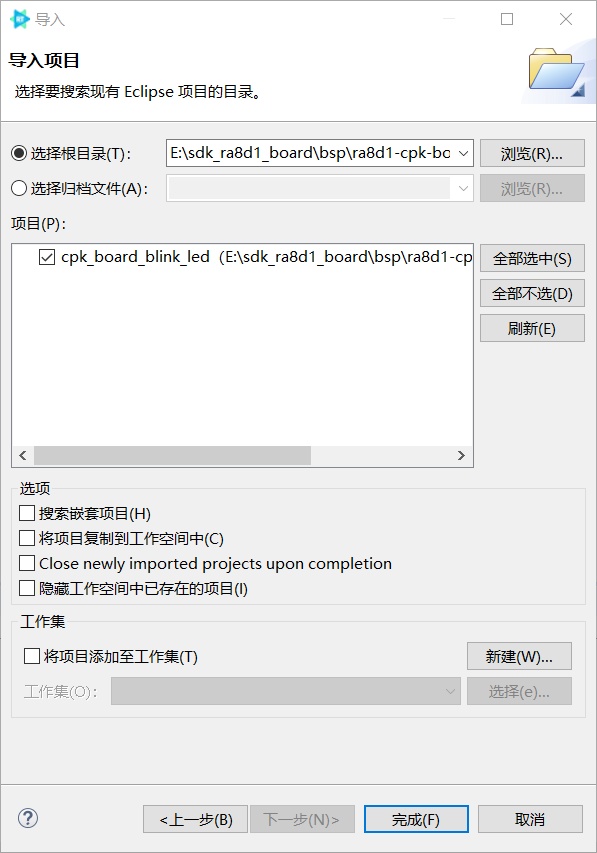
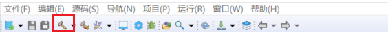
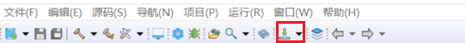

# ra8d1-cpk-board

**English** | [**中文**](./README_zh.md)

## Introduction

### CPKCOR-RA8D1B core board

The CPKCOR-RA8D1B core board is a modular development board designed by Renesas Electronics for the Chinese market. It uses Renesas RA8D1MCU and supports MIPI-DSI display output interface. The core board is already equipped with unique peripheral interfaces and devices supported by the RA8 MCU, which can be directly used for learning, evaluation, and application development.

The CPKCOR-RA8D1B development board is based on the Renesas Cortex-M85 architecture RA8D1 chip, providing engineers with a flexible and comprehensive development platform to help developers gain a deeper experience in the field of machine vision.





### CPKEXP-RA8D1B expansion board

The CPKEXP-RA8D1B is a universal expansion board compatible with the CPK-RA8x1 series core boards. It features interfaces similar to the EK-RA8x1, with some pins compatible with the EK-RA8x1, enabling convenient evaluation of most RA8x1 MCU functionalities.




#### Onboard hardware functions
- The USB-FS Type-C interface allows for the selection of Host or Device functions through a 2.0mm jumper combination, and supports the USB Boot function of the RA8x1 MCU.
-  Two CAN-FD transceivers, connected to MCU through a 2.54mm jumper socket, can flexibly adapt to the required CAN channels and pins.
- 100Mbps Ethernet, using LAN8720AI PHY.
- H0233S001 2.33-inch full interface LCD module, supporting MIPI-DSI/RGB666/SPI display interface (optional).
- QSPI Flash, WSON 6x8 package, can be mounted with NAND Flash (default not mounted).
- RESET button and NMI interrupt button, 1 user button.
- 1 power LED and 2 user LEDs.


#### Expansion interface

All expansion interfaces can be used as GPIO extensions, but in terms of pin distribution, I/O for the same peripheral function should be distributed together as much as possible. The specifications of the needle interface are all 2.54mm spacing.
PMOD interface, supports Type2A extended SPI interface (default) and Type3A extended UART interface (requires modification of jumper resistor).

- Arduino UNO extension interface.
- Grove interface 1 only supports I2C function.
- Grove interface 2, with optional I2C, I3C, or analog interface functions.
- 50pin FPC LCD touch screen expansion interface, supporting MIPI-DSI (2 Lane), RGB666, SPI display, I2C touch screen.
- 40pin dual pin LCD touch screen interface, supporting RGB888 display, I2C touch screen (compatible with EK-RA8D1).
- The 24 pin FPC CEU interface (DVP camera interface) can be directly connected to the OV7725 camera module.
- 30pin dual pin camera interface, with the first 20 pins defined to be compatible with EK-RA8D1.
- 20 pin FPC interface, used to expand OSPI devices (QSPI storage on the core board needs to be disabled).
- 20 pin dual row SDIO/MMC interface.
- 24 pin dual row GPIO signal expansion.
- 10 pin dual pin USB FS and debugging burning control.
- 10 pin CMSIS-DAP debugging interface.
- 20 pin ETM debugging interface (not actually installed).

## Directory Structure

```
$ ra8d1-cpk-board
├── README.md
├── documents
│   ├── RA8D1_Datasheet.pdf
│   ├── RA8D1_User’s Manual.pdf
│   ├── CPKCOR_RA8x1x_V2_schmatic_release.pdf
│   ├── CPKEXP_RA8x1x_V1_schmatic_release.pdf
│   └── images
├── cpk_board_blink_led
├── cpk_board_mipi_lcd
├── cpk_board_mipi_lvgl
├── cpk_board_ethernet
```

- documents: Includes drawings, documents, images, datasheets, etc.
- libraries: Generic peripheral drivers for RA8D1.
- cpk_board_xxx: Consists of example project folders, including factory programs, OpenMV programs, etc.


**sdk-ra8d1-board** supports development using both RT-Thread Studio and MDK.

## RT-Thread Studio Development Steps

1. Execute the mklinks.bat file to generate two folders: rt-thread and libraries.



*Note: If the mklinks script cannot be executed, manually copy the rt-thread and libraries folders from the sdk-ra8d1-board directory to the project directory.*

2. Open RT Thread Studio and import the project



3. Click the build button to compile the project.



4. Click the download button to flash the firmware.




## MDK Development Steps

1. Execute the mklinks.bat file to generate two folders: rt-thread and libraries.


*Note: If the mklinks script cannot be executed, manually copy the rt-thread and libraries folders from the sdk-ra8d1-board directory to the project directory.*

2. Open the project.uvprojx file to launch the MDK project.

ub.com/RT-

3. Click the build button to compile the project.


4. Click the download button to flash the firmware.

