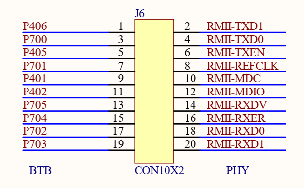
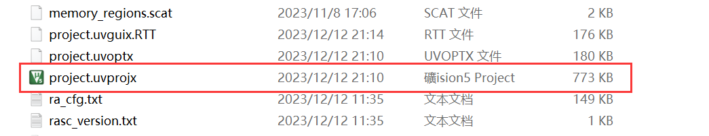
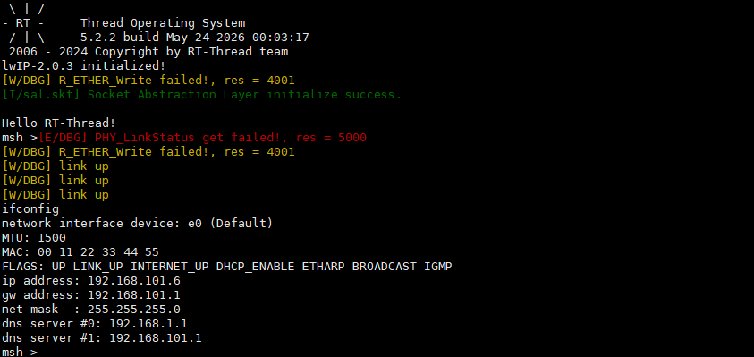
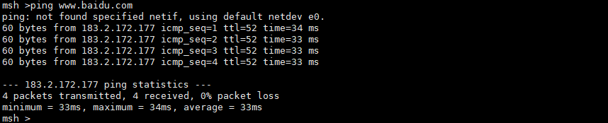

# cpk_board_ethernet

## 简介

本例程主要功能是以太网。

## 硬件说明

扩展板上有一个百兆以太网接口，使用的PHY是LAN8720I，RMII接口。由于RA8D1 MCU的设计限制，使用了SDRAM后，CEU摄像头接口和以太网接口就有复用，使用时请注意将以太网信号跳线全部连上，且不要在扩展板上安装摄像头

## 运行

### 编译&下载

#### MDK 方式

1、双击 `mklinks.bat` 文件，执行脚本后会生成 `rt-thread`、`libraries` 两个文件夹：

2、编译固件

双击 **project.uvprojx** 文件打开MDK工程

点击下图按钮进行项目全编译：

3、烧录固件

将开发板的 J-Link USB 口与 PC 机连接，然后将固件下载至开发板。

## 运行效果

编译工程，下载到开发板，连接网线，通过 ifconfig 命令查看是否成功获取 IP 地址。

然后ping下外网。

