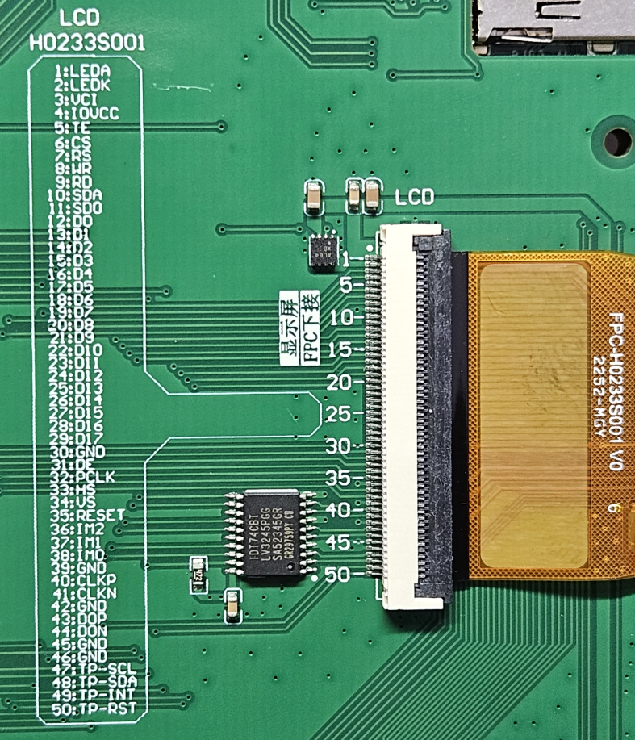
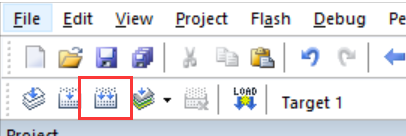
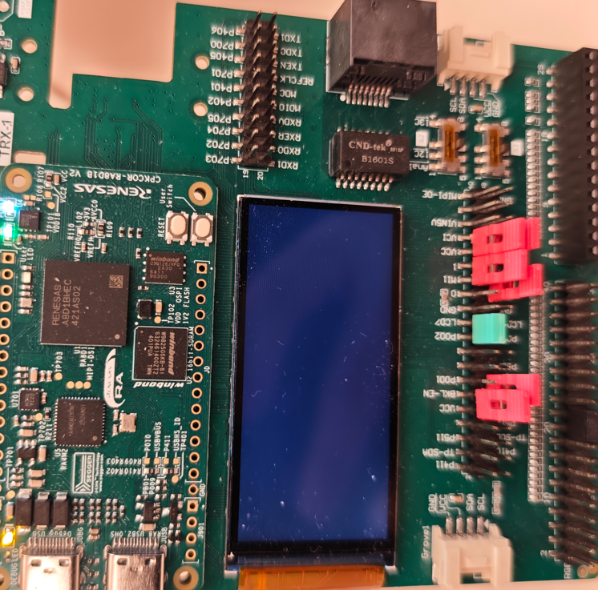

# cpk_board_mipi_lcd

## 简介

本例程主要功能是测试 MIPI 屏幕，通过测试命令可以在 LCD 屏幕上显示不同颜色。

## 硬件说明

* cpk-Board 开发板

MIPI 接口引脚定义如上图所示，需要将屏幕拓展板通过FPC排线插入 cpk-exp-Board 的MIPI接口中，接线方式见下图：

## 运行

### 编译&下载

#### MDK 方式

1、双击 `mklinks.bat` 文件，执行脚本后会生成 `rt-thread`、`libraries` 两个文件夹：

2、编译固件

双击 **project.uvprojx** 文件打开MDK工程

点击下图按钮进行项目全编译：

3、烧录固件

将开发板的 j-Link USB 口与 PC 机连接，然后将固件下载至开发板。

## 运行效果

* 打开 J-Link 虚拟出的串口终端，波特率为115200，串口终端中输入 `lcd_test` 指令后，LCD会以红、绿、蓝三个颜色分别刷新显示。

