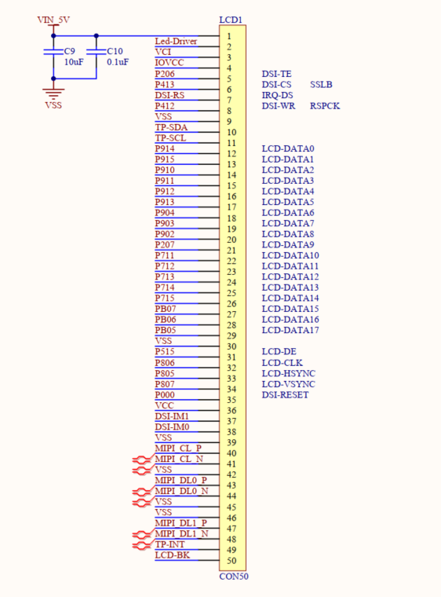
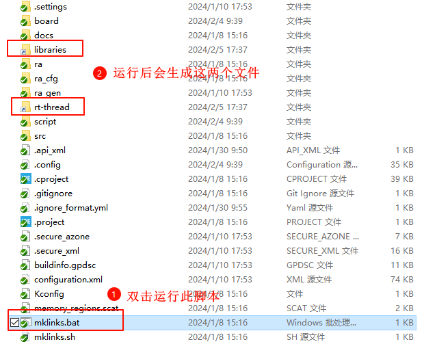
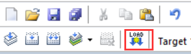
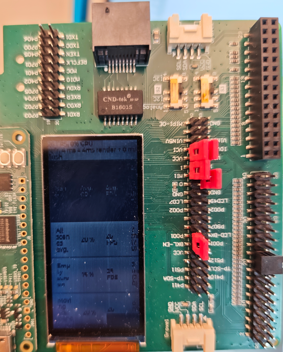
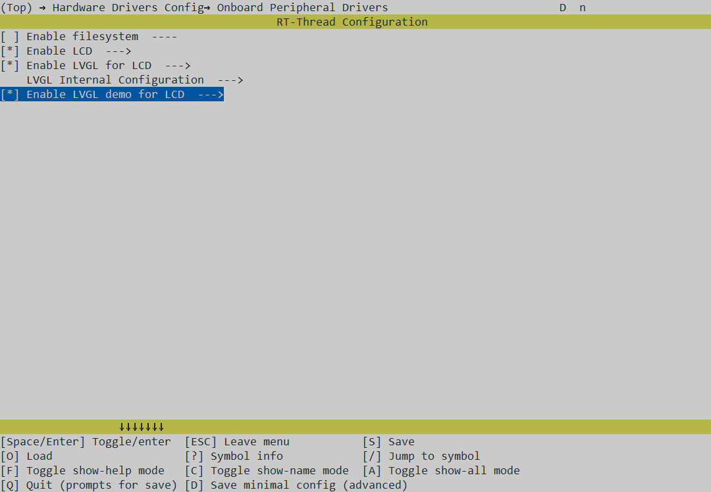
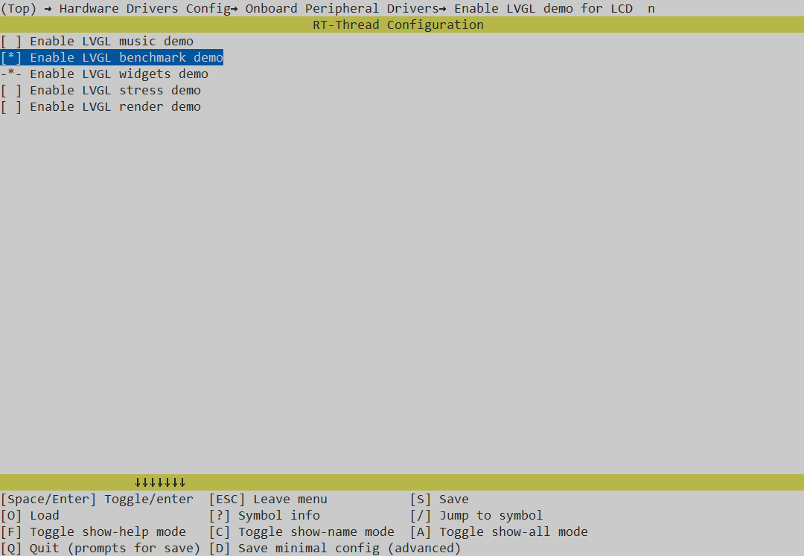

# cpk_board_mipi_lvgl

## 简介

LVGL 是一个免费的开源嵌入式图形库，它提供创建嵌入式 GUI 所需的功能，具有易于使用的图形元素、精美的视觉效果和低内存占用。

本例程是在 cpk-Board 开发板平台运行 LVGL9.0 图形库示例的 Demo。

## 硬件说明

* cpk-Board 开发板

将 mipi 屏幕与 cpk-Board 开发板通过 fpc 排线连接。

硬件连接示意图如下：

## 软件说明

对接 LVGL 显示部分的代码位于 `cpk_board_mipi_lvgl\board\lvgl\lv_port_disp.c` ；

如需修改LVGL的配置信息可以在 `cpk_board_mipi_lvgl\board\lvgl\lv_conf.h` 中手动修改/添加。

## 运行

### 编译&下载

#### MDK 方式

1、双击 `mklinks.bat` 文件，执行脚本后会生成 `rt-thread`、`libraries` 两个文件夹：

2、编译固件

双击 **project.uvprojx** 文件打开MDK工程

点击下图按钮进行项目全编译：

3、烧录固件

将开发板的 J-Link USB 口与 PC 机连接，然后将固件下载至开发板。

## 运行效果

固件烧录完毕后，系统正常运行，默认运行的是 LVGL 的 benchmark Demo。

## 运行其他Demo

* RT-Thread 为cpk-Board 适配了许多 LVGL demo，大家后续添加 Demo 也可以按照如下方式添加。

1、打开 env 终端，进入 → Hardware Drivers Config → On-chip Peripheral Drivers 中，选择使能 LVGL Demo；

2、输入回车键，进入菜单选项，选择想运行的 Demo，然后按Esc键返回并保存配置；

3、在终端中输入 `scons --target=mdk5` 生成工程；

4、编译、烧录查看现象；

