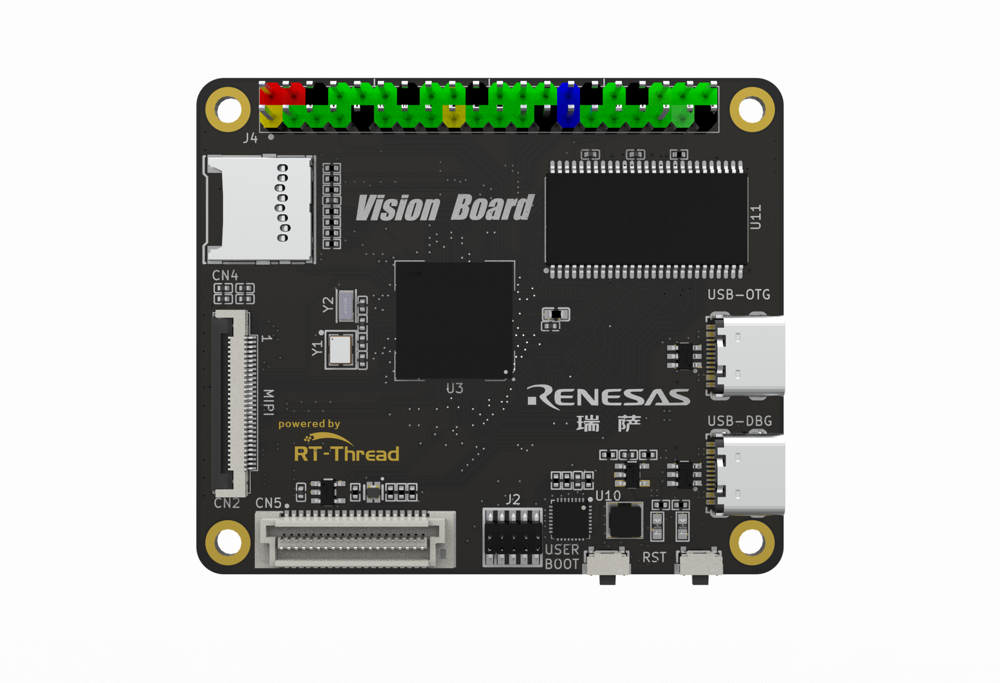
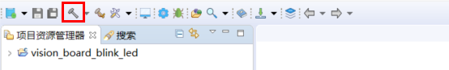
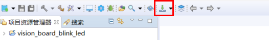

# ra8d1-vision-board

**English** | [**中文**](./README_zh.md)

## Introduction

**ra8d1-vision-board** is the support package developed by the RT-Thread team for the Vision-Board development board. It serves as a software SDK for users to simplify their application development process.

The Vision-Board development board, based on the Renesas Cortex-M85 architecture RA8D1 chip, offers engineers a flexible and comprehensive development platform, empowering them to explore the realm of machine vision more deeply.





## Directory Structure

```
$ ra8d1-vision-board
├── README.md
├── documents
│   ├── RA8D1_Datasheet.pdf
│   ├── RA8D1_User’s Manual.pdf
│   ├── CPKCOR_RA8x1x_V2_schmatic_release.pdf
│   └── images
├── vision_board_blink_led
├── vision_board_camera
├── vision_board_mipi_2.0inch
├── vision_board_mipi_2.0inch_lvgl
├── vision_board_wifi
```

- documents: Includes drawings, documents, images, datasheets, etc.
- libraries: Generic peripheral drivers for RA8D1.
- vision_board_xxx: Consists of example project folders, including factory programs, OpenMV programs, etc.


**sdk-ra8d1-board** supports development using both RT-Thread Studio and MDK.

## RT-Thread Studio Development Steps

1. Execute the mklinks.bat file to generate two folders: rt-thread and libraries.


*Note: If the mklinks script cannot be executed, manually copy the rt-thread and libraries folders from the sdk-ra8d1-board directory to the project directory.*

2. Open RT Thread Studio and import the project


3. Click the build button to compile the project.



4. Click the download button to flash the firmware.




## MDK Development Steps

1. Execute the mklinks.bat file to generate two folders: rt-thread and libraries.


*Note: If the mklinks script cannot be executed, manually copy the rt-thread and libraries folders from the sdk-ra8d1-board directory to the project directory.*

2. Open the project.uvprojx file to launch the MDK project.

ub.com/RT-

3. Click the build button to compile the project.


4. Click the download button to flash the firmware.

